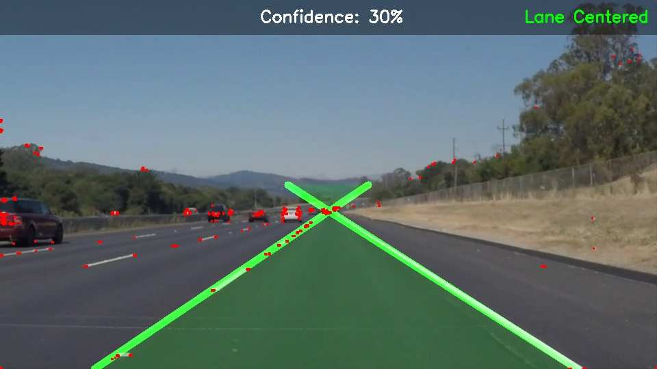
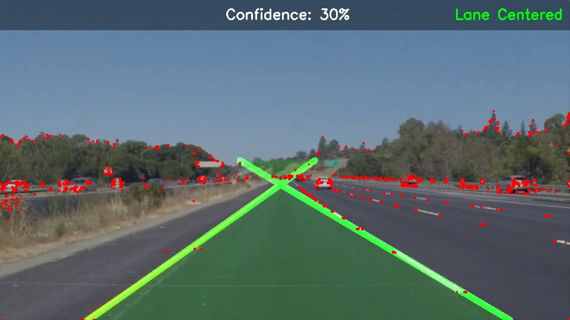

# Lane Detection System
A lane detector system in real-time that was constructed using classical computer vision.
as a course of CSE3010 Computer Vision. Dashcam footage is processed by the system.
to identify lane markings, visualize driving space, trace road characteristics and
alarm lane departure to the driver.

---

## Demo



---

## Features
- Identifies both image and video left and right lane boundaries.
- HLS color masking to process white and yellow lane markings.
- Region of Interest (ROI) masking to concentrate on the road ahead.
- Visualization of lane areas with visual fill using green.
- Harris Corner Detection to detect significant road objects.
- Optical Flow (Lucas-Kanade) to compute the motion of features between video frames.
- Lane departure warning system (pulling out to the left, right, or center)
- Confidence score per frame depending on the number of lines detected.
- FPS counter on video output
- Runs all the files on test_images/ and test videos.
- No interactive interface needed - Fullly runnable at the command line.

---

## Tech Stack
- Python 3.x
- OpenCV
- NumPy

---

## Project Structure
```
lane-detection-cv/
├── test_images/
├── test_videos/
├── output_images/
├── output_videos/
└── lane_detection.py
```

---

## Output Log
After every run, a `results.txt` file is generated in the project root summarising how many images and videos were processed and listing all output files.

---

## Dataset
The test images and videos used in this project are the ones found in the.
UDacity CarND Lane Lines Project (https://github.com/udacity/CarND-LaneLines-P1).

Test images include:
- solidWhiteCurve.jpg
- solidWhiteRight.jpg
- solidYellowCurve.jpg
- solidYellowCurve2.jpg
- solidYellowLeft.jpg
- whiteCarLaneSwitch.jpg

---

## Installation
1. Clone the repository:
```bash
git clone https://github.com/im-ad-45/lane-detection-cv.git
cd lane-detection-cv
```

2. Install dependencies:
```bash
pip install opencv-python numpy
```

---

## Usage
Execute the script:
```bash
python lane_detection.py
```

The script will automatically work on all the images on the directory test images/ and all.
videos in `test_videos/`. Output images are stored to output images/
`output_videos/` respectively. Both folders are automatically created provided that
they don't exist. None of the GUI or manual input is needed.

---

## How It Works
The pipeline has the following stages:

1. **HLS Color Masking** - transforms the frame to HLS color space and isolates it.
white and yellow pixels, which enables lane detection to be resistant to changes in lighting.

2. **Grayscale + Gaussian Blur** — converts the masked frame to grayscale and
blurs to minimize noise then edge detects.

3. **Canny Edge Detection** - This detects sharp intensity changes in accordance.
to lane boundaries with a low threshold of 50 and high threshold of 150.

4. **Region of Interest Masking** - uses a triangular mask to restrict.
processing to the road space in front of it, removing the sky and scenery.

5. **Hough Transform** - identifies straight lines between the edge points and extrapolates.
linear regression of them into full lane lines using numpy polyfit.

6. **Harris Corner Detection** - detects corner features on the entire frame.
with a 2x2 neighbourhood and k=0.04, and Module 3 feature extraction is covered.

7. **Optical Flow (Lucas-Kanade) -tracks detected corners between successive.
Movement analysis of video with pyramidal LK method, including Module 4.
motion analysis. The refresh rate of points is 30 frames or loss of tracking.

8. **Lane Departure Warning** — compares the centrally located point between the two lanes detected.
lines on the bottom of the frame on the frame center. Triggers a red
warns on an offset of more than 50 pixels in either direction.

9. **HUD Overlay** - shows FPS, confidence score and lane departure warning.
on a semi-transparent bar at the head of each frame.

---

## Syllabus Coverage (CSE3010)
| Module | Topic | Implementation |
|--------|-------|----------------|
| Module 1 | Image filtering, histogram processing | Gaussian blur, HLS color masking |
| Module 3 | Canny edge detection, Hough Transform, Harris Corner Detection | `cv2.Canny`, `cv2.HoughLinesP`, `cv2.cornerHarris` |
| Module 4 | Optical flow, motion analysis | `cv2.calcOpticalFlowPyrLK`, `cv2.goodFeaturesToTrack` |
---

## Limitations
- The Hough Transform presupposes straight lanes - the algorithm cannot work on sharp curves.
- Lane lines are brought to the vanishing point, and they seem to intersect at.
the upper part of the frame that is supposed to be behaviour because of perspective projection.
- Harris corner detection fires on high-textured areas not on the road like
trees and sky, as it is driven on the full frame instead of the ROI.
- The difficulty video that contains shadows and changes of colors of the road decreases the accuracy of detection.
- Optical flow cannot work on still images but only on video output.

---

## Course
CSE3010 — Computer Vision
VIT Bhopal University